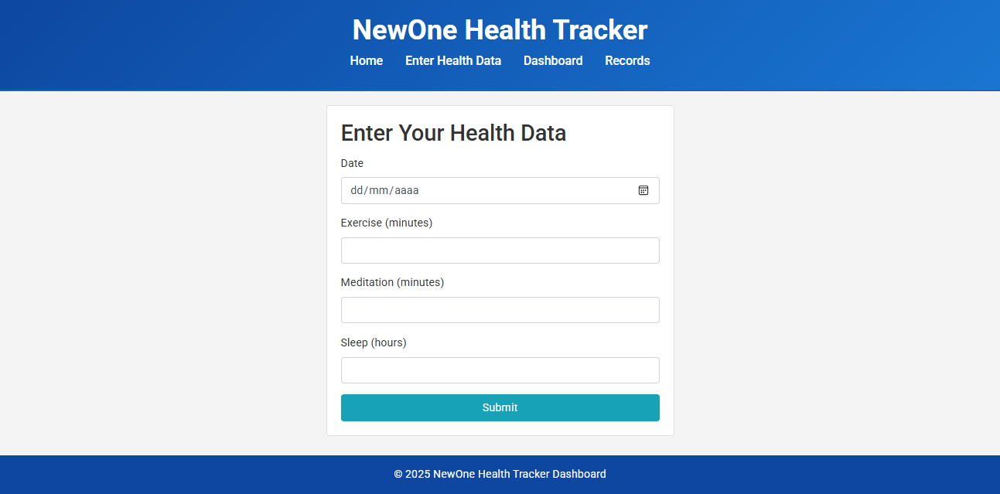
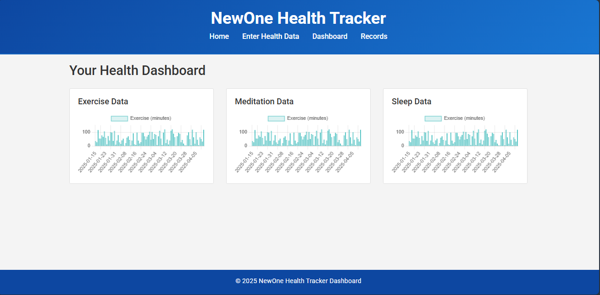
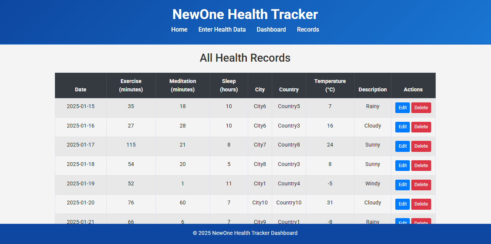
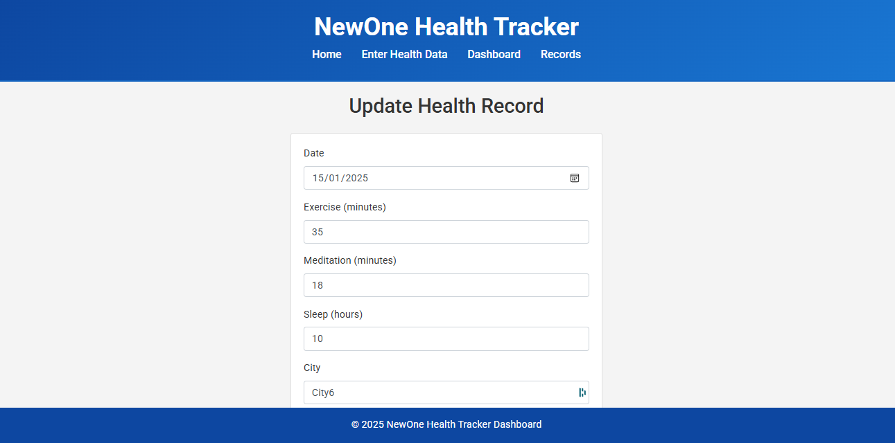

# NewOne Health Tracker

## Descrição do Projeto

O **NewOne Health Tracker** é um sistema web que permite o cadastro, visualização e gerenciamento de atividades físicas, utilizando uma arquitetura baseada em API REST.  
A aplicação é composta por três componentes principais:

- **Interface (Frontend):**  
  Uma interface moderna em HTML, CSS e JavaScript que possibilita aos usuários inserir e visualizar dados das atividades físicas.

- **API Backend:**  
  Implementada com Flask, essa API é responsável por controlar o fluxo da aplicação, realizando operações de CRUD (criar, ler, atualizar, excluir) sobre os registros de atividades armazenados em um banco de dados SQLite.

- **API Externa (Open Weather):**  
  Um microserviço independente que obtém dados climáticos do OpenWeatherMap e os disponibiliza através de um endpoint REST. A API Backend integra esses dados para complementar as informações inseridas pelos usuários.

> **Cenário Selecionado:**  
> Este projeto segue o cenário 1.1, onde a comunicação com uma API externa (OpenWeather) é realizada pelo Backend. Quando o usuário submete o formulário na rota /form, o Flask processa essa submissão no servidor e executa a função get_weather_data(API_KEY) para recuperar os dados climáticos. Esses dados são então usados para complementar as informações do formulário antes de serem salvos no banco de dados. Portanto, a integração com o OpenWeather ocorre inteiramente no lado do servidor, ou seja, no backend.

## Estrutura do Projeto

A estrutura do repositório está organizada da seguinte forma:
```graphql
docker-compose.yml # Orquestração dos containers da API Backend e do microserviço Weather

newone-health-tracker/
│
├── app.py # API Backend: gerencia o fluxo da aplicação e o cadastro de atividades 
├── forms.py # Definição dos formulários para cadastro e atualização de dados (Flask-WTF) 
├── seed.py # Script para popular o banco de dados com dados de teste 
├── requirements.txt # Dependências do projeto 
├── Dockerfile # Dockerfile para construção do container da API Backend 
│ 
├── templates/ # Arquivos HTML (interface do usuário) 
│ ├── base.html 
│ ├── index.html 
│ ├── form.html 
│ ├── dashboard.html 
│ ├── records.html 
│ └── update_record.html 
│ 
├── static/ # Arquivos estáticos (CSS, imagens, JavaScript, etc.) 
│ └── css/ 
│ └── style.css 

weather_service/ # Microserviço para obtenção de dados climáticos
│ └── weather_service.py # Código que consulta o OpenWeatherMap e expõe o endpoint REST (/weather) 
│ └──  Dockerfile # Dockerfile para construção do container do microserviço Weather
```


## Instruções de Instalação e Configuração

### Pré-requisitos

- [Docker](https://docs.docker.com/get-docker/)
- [Docker Compose](https://docs.docker.com/compose/install/)
- (Opcional para desenvolvimento local) Python 3.9 ou superior e um ambiente virtual configurado

### Configuração Local (Desenvolvimento)

1. **Clone o repositório:**
```bash
   git clone <URL_DO_REPOSITORIO>
   cd project-root
```
2. Crie e ative um ambiente virtual (opcional):
```bash
python -m venv venv
source venv/bin/activate  # Linux/macOS
venv\Scripts\activate     # Windows
```
3. Instale as dependências:
```bash
pip install -r requirements.txt
```
4. Popular o Banco de Dados:
 - Execute o script de seed para gerar registros de teste. Se necessário, via docker-compose run app python seed.py para criar/popular o banco.
```bash
python seed.py
docker-compose run app python seed.py # via docker
```
5. Inicie a API Backend:
```bash
python app.py
```
A aplicação estará disponível em http://localhost:5000.

## Executando com Docker Compose
1. Build e execução dos containers: Na raiz do projeto, execute:
```bash
docker-compose up --build
```
Isso iniciará dois containers:
  * app: API Backend na porta 5000.
  * weather: Microserviço de dados climáticos na porta 5001.

2. Acesso:
  * A Interface estará disponível em: http://localhost:5000
  * O microserviço Weather será acessado internamente pelo container weather (exemplo de URL: http://weather:5001/weather?apikey=SEU_API_KEY).

## Fluxograma da Arquitetura da Aplicação
A seguir, um fluxograma ilustrando a arquitetura do sistema:


## Interface do Usuário
A aplicação conta com páginas que permitem as seguintes funcionalidades:

* Página Inicial (index.html):
Apresenta a visão geral do sistema e direciona para o cadastro de atividades.


* Cadastro de Atividades (form.html):
Permite a inserção dos dados das atividades físicas, complementados com informações climáticas obtidas via API externa.


* Dashboard (dashboard.html):
Exibe gráficos e estatísticas das atividades cadastradas, possibilitando visualização histórica dos dados.


* Listagem de Registros (records.html):
Uma tabela que lista todos os registros com opções para editar ou excluir cada entrada.


* Atualização de Registro (update_record.html):
Permite a edição dos dados cadastrados.


## Arquitetura REST
A aplicação utiliza uma arquitetura REST para:
* API Backend: Gerencia as operações de CRUD (criação, leitura, atualização e exclusão) dos registros de atividades.
* Como formulários HTML suportam nativamente apenas métodos GET e POST, somente estes são utilizados no projeto.
* Para consulta inseri os métodos PUT e DELETE comentados no arquivo app.py, pois não são utilizados no projeto final.
* Microserviço Weather: Fornece os dados climáticos a partir do OpenWeatherMap. O serviço é consumido pela API Backend para complementar os registros inseridos pelos usuários.

A comunicação entre os componentes ocorre da seguinte forma:
1. O usuário interage com a interface (Frontend).
2. Os dados inseridos são enviados para a API Backend, que os armazena em um banco de dados SQLite.
3. Quando necessário, a API Backend consulta o microserviço Weather (por meio do endpoint REST /weather) para adquirir as informações climáticas.
4. Os dados são então exibidos na interface, seja no dashboard ou na listagem de registros.

## Docker e Orquestração
Cada componente do sistema é containerizado utilizando Docker. O docker-compose.yml permite iniciar de forma integrada tanto a API Backend quanto o microserviço Weather.
* Dockerfile do API Backend: Configura o ambiente para rodar o Flask e gerenciar os registros de saúde.
* Dockerfile do Microserviço Weather: Configura o ambiente para rodar o serviço que consome a API do OpenWeatherMap.
